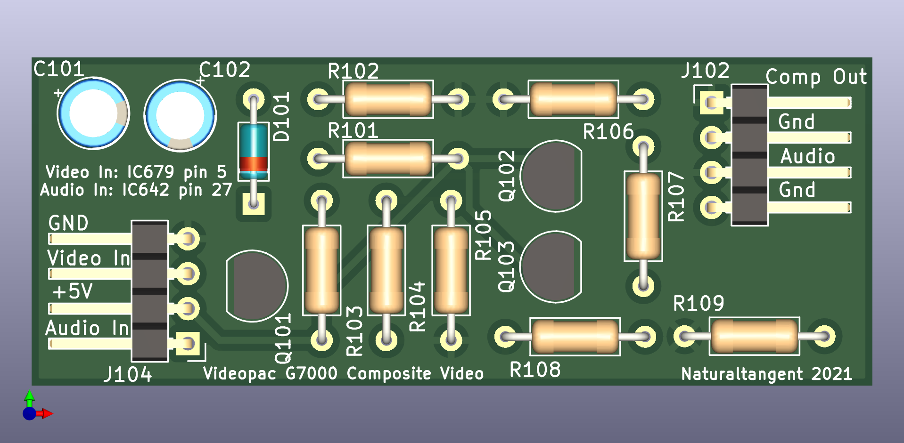

# Videopac G7000 Composite Video

This is a PCB providing composite video amplification for a PAL VideoPac G7000.

Created using kicad 6.0.0

## Schematic

The schematic is copied from https://gamesx.com/wiki/doku.php?id=av:g7000_av

## PCB

The PCB measures 60.5mm X 23.5mm.

## BOM

[videopac_rgb_bom.csv](videopac_composite_bom.csv "BOM")

## Installation

Check the schematic for your variant of Videopac PCB, I'm led to believe that different revisions have different IC references and locations.

On the revision I tested with the IC are located as illustrated below (I desoldered the shield to access IC679 to confirm the its identity);

Viewing from the top of the PCB, the location of the input pins are illustrated below;

I soldered to the bottom of the board as shown below;

